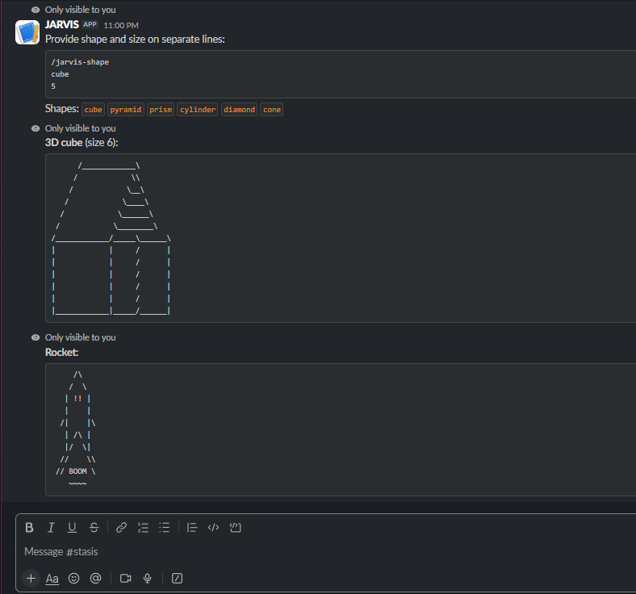

## What it does

---

### 🧊 `/jarvis-shape` — 3D ASCII Shapes
Draws a 3D ASCII shape right in the chat.
You give it a shape name and a size — it builds it character by character.
No libraries. Just JavaScript doing math with text.

**Available shapes:** `cube` `pyramid` `prism` `cylinder` `diamond` `cone`

/jarvis-shape
cube
5

---

### 🔤 `/jarvis-text` — Giant 3D Letters
Takes any name or word and renders it in giant 3D ASCII letters.
Every letter from A to Z is hand-designed as a 4-row character glyph.
Pick a style and your name has never looked this good in a chat window.

**Available styles:** `block` `shadow` `banner`

/jarvis-text
TONY
banner

---

### 🎨 `/jarvis-fun` — ASCII Art Scenes
Drops a pre-built ASCII art scene into the channel.
No reason needed. Just fun.

---

### 😂 `/jarvis-joke` — Random Joke
Fetches a real two-part joke from a live API.
Setup line first, punchline after.
Sometimes brilliant. Sometimes terrible. Always worth it.

---

### 🐱 `/jarvis-catfact` — Random Cat Fact
Pulls a fresh random cat fact from catfact.ninja every time.
You will learn things about cats you never asked for.
You will not regret it.

---

### 🏓 `/jarvis-ping` — Health Check
Checks if the bot is alive and returns the exact latency in milliseconds.
Useful when you want to know JARVIS is up and running.

**Available art:** `rocket` `trophy` `castle` `robot` `fire` `crown` `sword` `shield`

